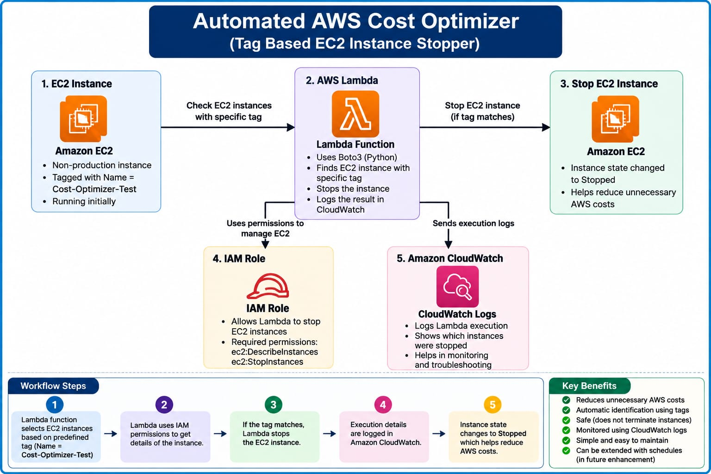
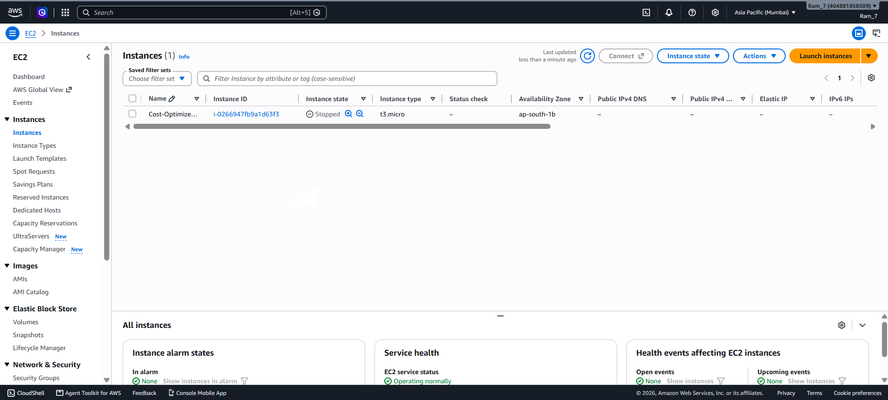
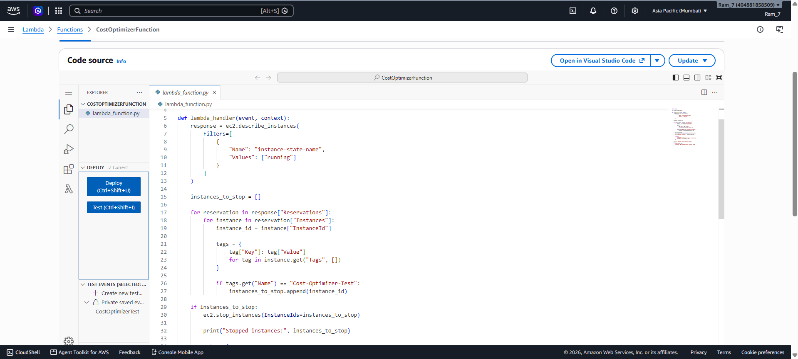
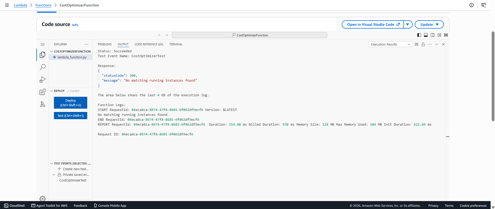
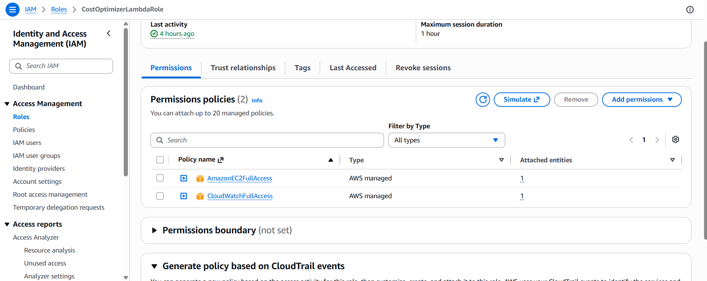
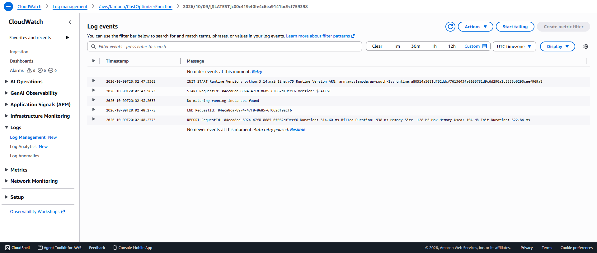
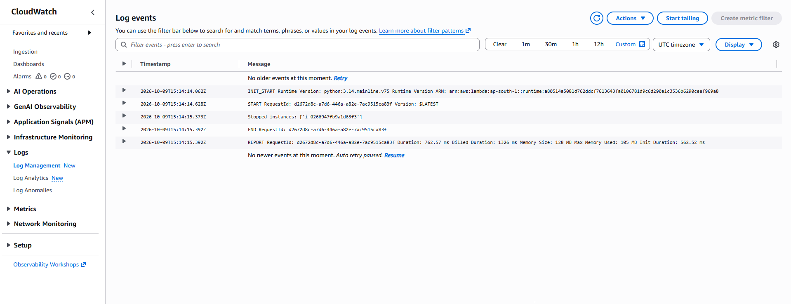

# 💰 Automated AWS Cost Optimizer

## 📌 Project Overview

This project is an **Automated AWS Cost Optimizer** built using AWS Lambda, Amazon EC2, IAM, and Amazon CloudWatch.

The Lambda function identifies selected running EC2 instances using a predefined tag and safely stops the matching instance. This helps reduce unnecessary AWS costs by preventing selected non-production resources from running when they are not required.

The project uses a clearly defined tag-based rule and does not blindly terminate AWS resources.

---

## 🎯 Objective

The main objective of this project is to:

- Identify selected running EC2 instances.
- Check EC2 instances using predefined tags.
- Stop only the approved non-production EC2 instance.
- Reduce unnecessary AWS resource usage.
- Monitor Lambda execution using Amazon CloudWatch.

---

## ☁️ AWS Services Used

| AWS Service | Purpose |
|---|---|
| Amazon EC2 | Test compute instance managed by the optimizer |
| AWS Lambda | Executes the cost optimization logic |
| AWS IAM | Provides required permissions to Lambda |
| Amazon CloudWatch | Stores and monitors Lambda execution logs |
| Python / Boto3 | Communicates with AWS services programmatically |

---

## 🏗️ Architecture

The project follows this workflow:

**Amazon EC2 → AWS Lambda → Tag Validation → Stop Selected EC2 Instance → CloudWatch Logs**

IAM provides the required permissions to the Lambda function.

### Architecture Diagram

---

## ⚙️ How It Works

1. A test EC2 instance is created with the name tag `Cost-Optimizer-Test`.
2. The Lambda function searches for running EC2 instances.
3. Lambda reads the tags attached to each running instance.
4. Only an instance with the exact `Name` tag `Cost-Optimizer-Test` is selected.
5. Lambda sends the stop request for the selected instance.
6. The EC2 instance changes from **Running** to **Stopped**.
7. Execution details are recorded in Amazon CloudWatch Logs.

---

## 🔐 Security

The project uses an IAM role to allow the Lambda function to interact with EC2 and CloudWatch.

The automation uses a specific EC2 tag condition before performing the stop action. It does not terminate instances and does not blindly stop every EC2 instance.

For a production environment, IAM permissions should be restricted further using the principle of least privilege.

---

## 💻 Lambda Source Code

The complete Lambda source code is available here:

[`lambda_function.py`](lambda_function.py)

The function uses Python and Boto3 to identify and stop the selected EC2 instance.

---

## 📸 Project Screenshots

### 1. EC2 Instance

Shows the EC2 instance used for the cost optimization test.

### 2. Lambda Function Code

Python/Boto3 code used by the Lambda function.

### 3. Lambda Test Execution

Successful Lambda execution confirming the EC2 stop operation.

### 4. IAM Role and Permissions

IAM permissions used by the Lambda function to interact with AWS resources.

### 5. CloudWatch Monitoring

CloudWatch logs used to monitor Lambda execution.

### 6. CloudWatch Execution Logs

Execution logs confirm that the selected EC2 instance was successfully processed.

---

## ❗ Failure Handling

If no matching running EC2 instance is found, the Lambda function does not stop any resource and returns:

`No matching running instances found`

Lambda execution details can be checked in CloudWatch Logs for monitoring and troubleshooting.

---

## 🚀 Production Improvements

For a production environment, this project can be improved by:

- Using least-privilege IAM policies.
- Supporting multiple approved tags and environments.
- Adding notifications for optimization actions.
- Adding scheduling to stop development instances outside working hours.
- Adding logic to start approved instances during working hours.
- Adding additional monitoring and alerts.

---

## ✅ Project Result

The project successfully demonstrates a tag-based AWS cost optimization workflow.

The Lambda function identified the approved EC2 instance using the `Cost-Optimizer-Test` tag, stopped the instance successfully, and recorded the execution details in Amazon CloudWatch.

This provides a simple and safe approach to reducing unnecessary EC2 usage without terminating resources.

---

## 🛠️ Technologies

- AWS Lambda
- Amazon EC2
- Amazon CloudWatch
- AWS IAM
- Python
- Boto3
